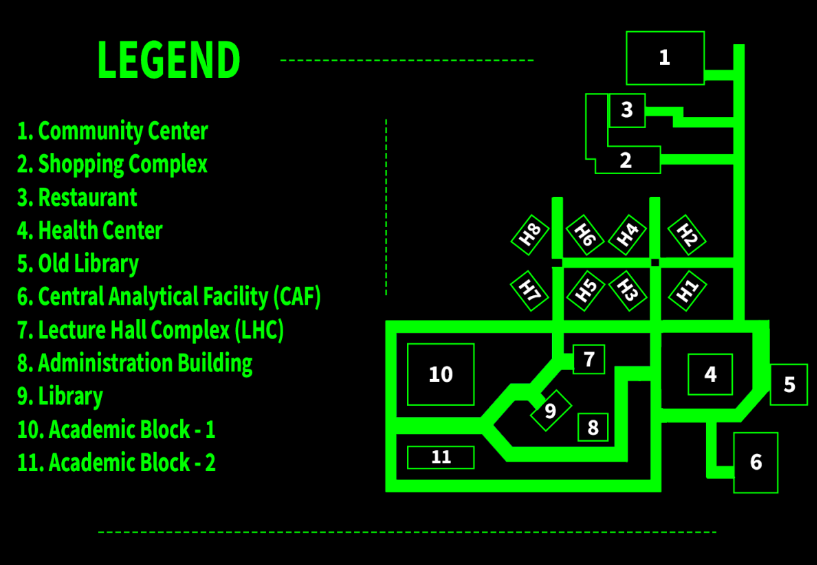
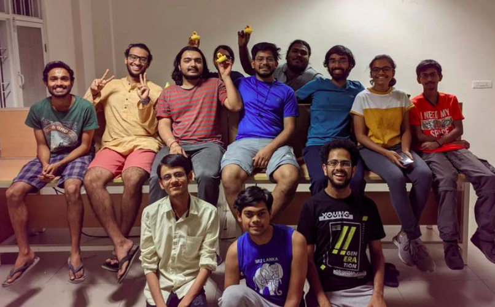
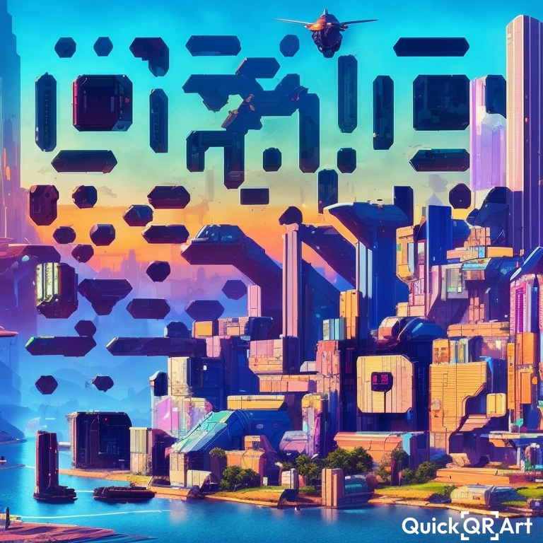
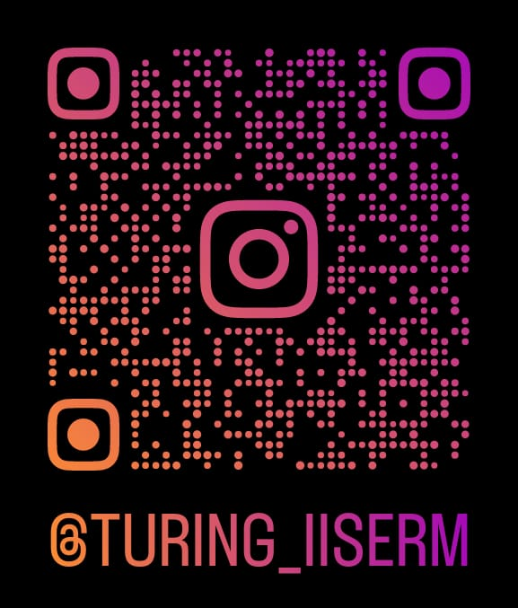

# Hello MS-23!!

---

Convener: Aditya Jain
 
Co-Convener: Kaushik Gupta and Rajnil Mukherjee!
 
## Who are we

Turing Club is a group of students who feel that Computers are more than just tools to make PDFs.

---

We are people who code for science, for building the digital world and obviously for fun.

# Computation in Science

---

Computers have been extremely useful in Science. Physics, Biology, Chemistry, Mathematics... literally every subject has progressed in leaps and bounds with the advent of faster calculations, better visualisations and easier data.

## Last Year

- Our first Turing Week (A week where we host lots of events and workship for you to learn, tinker and enjoy!!)
  - Interesting talks with students and professors.
  - Treasure Hunt
  - Interactive Robotics workshop (with **Robotics Club obviously**)
  
- Fun Stuff
  - Date-A Programmer (with **Patang Club**)
  - Techtionary

---

---

---

---

---

---

---

<!--<video src="file.mp4" playbackRate=10 controls autoplay></video>
-->

<link href="https://vjs.zencdn.net/5.10.4/video-js.css" rel="stylesheet">

<video id="my-video" class="video-js" controls preload="auto" data-setup='{"playbackRates": [4, 6] }'>
   <source src="file.mp4" type='video/mp4'>
</video>

Atomic Configuration

# Computers Themselves

---

Obviously we also explore the beautiful world of computers and applications of them in enhancing our lives and academic purposes. 

## Related Events

- Programming with Haskell - _Prof. Shane D'Mello_
- Numerical Computations, Accuracy and Analysis - _Prof. Kapil H Paranjape_
- Parallel Computing - _James_
- Animation with python - _Nikhil_
- Workshop on Numpy, Scipy and Matplotlib for Scientific Computing - _Kshitish and Darsh_
- Introduction to Quantum Computing(with **Phi@i**) - _Nikhil_

# Fun events

## A Frozen Enigma - Offline Treasure Hunt

## Grand Thesis Adventure: Stress City - Virtual Treasure Hunt

 Map

---

---

# That was our past

# Now, to the future

---

- Adding new features for our app **Insight** to serve the IISER community.
- Talk series on Extensive need of Computation in all field of Sciences.
- More Turing Week!
- More Hackathons with other clubs!

# We Don't Just Explore Worlds, We Build Them!

[https://iiserm.github.io/turing-club](https://iiserm.github.io/turing-club)

# Insight: The App of IISER-Mohali

---

# Follow us on Instagram

# Follow us on Twitter

# Follow us on github

# Thank You

## Links and Attributes

Most of the images were either made during Turing Club events or by Individuals associated with the Club. All Rights Reserved to the Club/Individual. Some of the animations were taken from Julia Packages and [Bohm](https://www.youtube.com/watch?v=dn2HDzcOQ44)

This document was made using [Pandoc](https://pandoc.org) and [revealjs](https://revealjs.com).